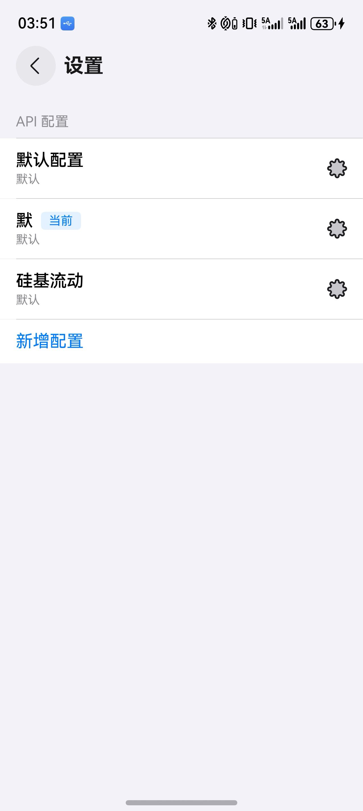
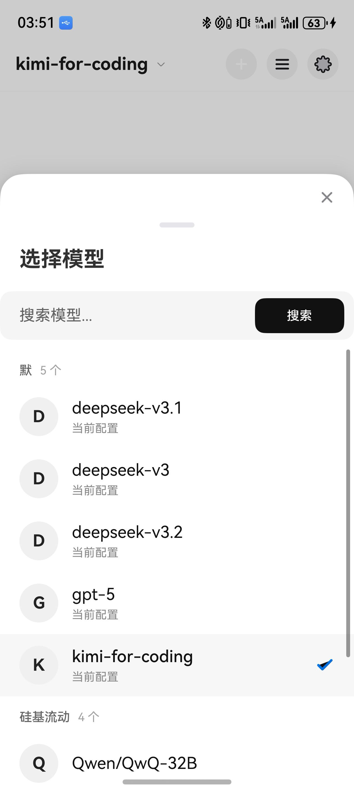

# 团子 AI

> 说明：这个项目基本是全 AI 编程做出来的（主要用了 GPT、Gemini、Claude、GLM）。我自己还在学 ArkTS，代码里肯定有不够好的地方，欢迎提 Issue / PR 一起改进。

团子 AI 是一款基于 HarmonyOS NEXT (ArkTS) 的 API 调用客户端：你可以添加不同的 API 配置，快速切换模型进行对话，并支持流式输出、Markdown 渲染、附件发送与会话管理。

## 功能特性

- 多 API 配置管理（可切换不同服务商/模型）
- 模型选择与搜索（按配置分组）
- 对话流式输出与会话持久化
- Markdown 渲染（代码块、引用等）
- HTML 代码预览弹窗
- 图片与文件附件发送
- 历史会话按天分组

## 界面预览

> 截图建议放在 `docs/screenshots/`，以下是默认引用路径。






## 技术栈

- HarmonyOS NEXT
- ArkTS / ArkUI
- 网络请求：`@kit.NetworkKit`
- Markdown 渲染：`@luvi/lv-markdown-in`

## 项目结构

```text
entry/src/main/ets/
├─ pages/                 # 页面与业务逻辑
├─ view/                  # 可复用 UI 组件
├─ entryability/          # 应用入口 Ability
└─ entrybackupability/    # 备份扩展 Ability
```

## 本地运行

### 1. 环境要求

- DevEco Studio（建议与项目 SDK 保持一致）
- HarmonyOS SDK `6.0.2(22)`
- Node.js（使用 DevEco 内置 Node 亦可）

### 2. 安装依赖

```bash
ohpm install
```

### 3. 构建

```bash
hvigorw assembleHap
```

或使用 DevEco Studio 直接运行。

## 配置说明

首次启动后请在应用内添加 API 配置：

- API Endpoint
- API Key
- 默认模型
- 温度与最大输出 token

## 致谢

- 这个项目能做出来，离不开 GPT、Gemini、Claude、GLM 这些 AI 工具的持续帮助，真的省了我很多摸索时间。
- Markdown 渲染用到了 [lv-markdown-in](https://gitee.com/luvi/lv-markdown-in)
